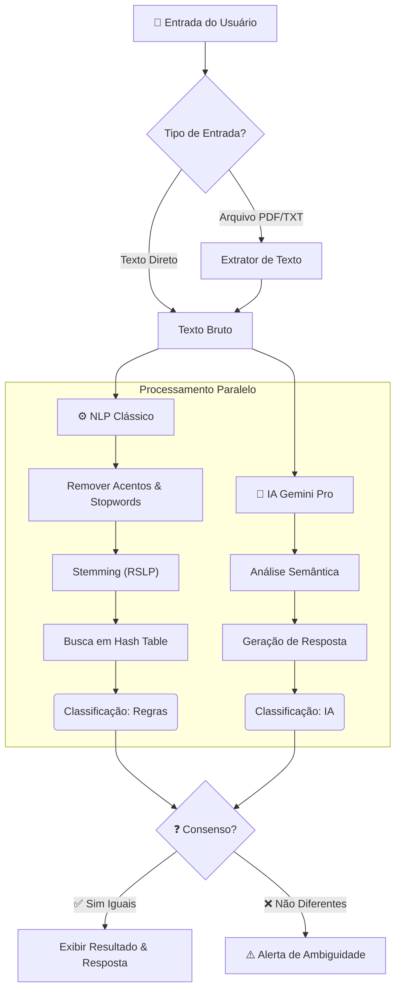

<div align="center">

# 📧 Interpretador de Email Inteligente

### Classificação Híbrida de Emails com NLP & IA Generativa


<br />

<p align="center">
  <a href="#-sobre">Sobre</a> •
  <a href="#-features">Features</a> •
  <a href="#-como-funciona">Lógica Híbrida</a> •
  <a href="#-instalação">Instalação</a> •
  <a href="#-tecnologias">Tecnologias</a>
</p>

</div>

---

## 📸 Demonstração

<div align="center">
  
  <p><em>Interface moderna com suporte a Drag & Drop e análise em tempo real.</em></p>
</div>

---

## 💡 Sobre

O **Interpretador de Email Inteligente** é uma solução web que automatiza a triagem de caixas de entrada. Diferente de soluções comuns, ele utiliza uma **arquitetura de consenso**: combina a velocidade de regras baseadas em NLP clássico (NLTK) com a compreensão contextual de LLMs (Google Gemini).

O objetivo é separar o joio do trigo: identificar emails **Produtivos** (que exigem suporte técnico) de emails **Improdutivos** (agradecimentos, SPAM), sugerindo respostas automáticas precisas.

---

## 🚀 Features

| Funcionalidade | Descrição |
| :--- | :--- |
| **📥 Upload Flexível** | Suporte a arquivos `.pdf`, `.txt` (Drag-and-drop) ou entrada de texto manual. |
| **🧠 Análise Híbrida** | Validação cruzada entre algoritmo de regras (Stemming) e IA Generativa. |
| **🎨 UI Responsiva** | Interface limpa e moderna construída com **Tailwind CSS**. |
| **⚡ Performance** | Uso de **Tabelas Hash** para verificação instantânea de palavras-chave. |
| **🛡️ Segurança** | Validação de MIME Types, proteção CSRF e variáveis de ambiente (`.env`). |
| **📝 Smart Reply** | Geração automática de respostas técnicas e educadas via Gemini Pro. |

---

## 🧠 Como Funciona

O diferencial do projeto é o sistema de **Consenso**. O sistema só confirma a classificação se o método clássico e a IA concordarem.


## 🚀 Começando

### Pré-requisitos

- Python (v3.10 ou superior)
- Git
- Chave de API do [Google AI Studio](https://aistudio.google.com/)

### Instalação

#### 1. Clone o repositório

```bash
git clone [https://github.com/SEU-USUARIO/interpretador-email.git](https://github.com/SEU-USUARIO/interpretador-email.git)
cd interpretador-email

```
#### 2. Instale as dependências
```bash
 pip install -r requirements.txt
```
#### 3. Configure a Chave de API
Crie um arquivo .env na raiz do projeto e adicione sua chave:
```bash
GEMINI_API_KEY=sua_chave_aqui_sem_aspas
```
#### 4. Execute o Projeto
```bash
python manage.py makemigrations
python manage.py migrate
python manage.py runserver
```
## 🔧 Tecnologias Utilizadas

### Backend
- **Python 3 & Django 5**: Framework web robusto.
- **Google Generative AI**: Integração com Gemini Pro.
- **NLTK**: Processamento de linguagem natural (Stemming RSLP, Stopwords).
- **PyPDF2**: Extração de texto de arquivos.

### Frontend
- **HTML5**: Estrutura semântica.
- **Tailwind CSS**: Estilização moderna e responsiva.
- **JavaScript (Vanilla)**: Manipulação de DOM e Drag & Drop.

### Utils
- **Python-dotenv**: Gerenciamento de segurança.
- **Unicodedata**: Normalização de texto.

## 🔑 Funcionalidades

- **Upload Flexível**: Suporte a arquivos `.pdf`, `.txt` (Drag-and-drop) ou entrada de texto manual.
- **Análise Híbrida**: Validação cruzada entre algoritmo de regras (Stemming) e IA Generativa.
- **UI Responsiva**: Interface limpa construída com Tailwind CSS.
- **Performance**: Uso de Tabelas Hash (Sets) para verificação instantânea de palavras-chave (Complexidade O(1)).
- **Segurança**: Validação de MIME Types e proteção CSRF.
- **Smart Reply**: Geração automática de respostas técnicas e educadas via Gemini Pro.
